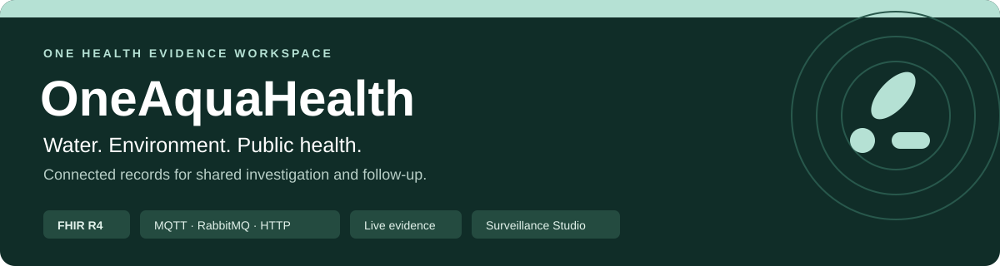
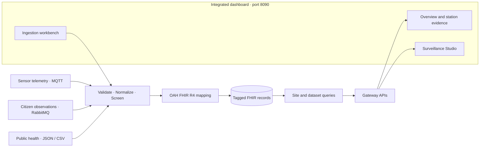

# OneAquaHealth



**Environmental and public-health evidence, connected through FHIR R4.**

[Launch the dashboard](https://oah.werfree.fun) · [Watch the demo](https://youtu.be/C1mKqq3cQqw?si=Q8Y9dZbK9zy5JwR6) · [Run locally](#quick-start) · [Explore the architecture](#architecture-and-data-flow)

OneAquaHealth brings environmental monitoring, citizen-science observations, and public-health indicators into a shared, location-aware FHIR R4 workflow. It validates and normalizes incoming records, applies screening rules, maps them to OAH FHIR profiles, and makes tagged records available for One Health summaries and analysis.

The intended use is to help environmental and public-health teams find relevant records and coordinate follow-up. A shared location or screening flag indicates an association for investigation; it does not establish causation or a clinical diagnosis.

## Project demo

[](https://oah.werfree.fun)

**Try the live app:** explore station evidence, upload source files, and investigate findings in Surveillance Studio.

Dashboard address: [oah.werfree.fun](https://oah.werfree.fun)

[](https://www.youtube.com/watch?v=C1mKqq3cQqw)

Click the video preview to watch the demo on YouTube.

- [Watch the project demo on YouTube](https://youtu.be/C1mKqq3cQqw?si=Q8Y9dZbK9zy5JwR6)

### Explore the demo

| Step | Where to go | What to inspect |
| --- | --- | --- |
| **1. Explore a station** | **Overview** → select a current station | Environmental observations, population-health context, screening findings, and their evidence references. |
| **2. Follow an ingestion** | **Data operator** persona → **Ingestion** | Run a supplied sample or preview and submit a JSON/CSV file; inspect validation, screening, and per-event FHIR outcomes. |
| **3. Investigate the evidence** | **Analyst** persona → **Surveillance** | Choose a station or all stations, ask a question, and inspect tool activity, charts, answers, transcripts, and exports. |

The [capability reference](#evidence-workspace) explains which views use live data and which are demonstration workflows. The [interpretation notes](#screening-and-interpretation) describe how to read screening results.

## What the project brings together

| Capability | What it provides |
| --- | --- |
| **Three ingestion channels** | MQTT sensor telemetry, RabbitMQ citizen-science observations, and HTTP JSON/CSV public-health input. |
| **A shared FHIR workflow** | Validated event envelopes, OAH-profiled FHIR R4 resources, dataset tags, provenance metadata, and transaction Bundles. |
| **Station evidence** | Environmental and health records linked by location, with source observations and screening references. |
| **Visible ingestion outcomes** | File previews, validation errors, screening outputs, uploaded/failed resource counts, and partial-batch results. |
| **Surveillance investigations** | Optional natural-language assistance, streamed tool activity, visual analyses, transcripts, CSV exports, FHIR Bundles, and executive HTML reports. |

## Quick start

For a local walkthrough, install the packages, copy [`.env.example`](.env.example) to `.env` if you do not already have one, and start the project with `run.py`. The example configuration opens the dashboard in live mode, with broker consumers disabled.

```powershell
python -m pip install -r requirements.txt
python -m pip install -e ".[dev]"
python run.py --open
```

Run these commands from the repository root, preferably in a virtual environment. The launcher uses the repository's `.venv` when present.

| Open locally | Address |
| --- | --- |
| **Evidence dashboard** | [http://127.0.0.1:8090/](http://127.0.0.1:8090/) |
| **Live evidence mode** | [http://127.0.0.1:8090/?mode=live](http://127.0.0.1:8090/?mode=live) |
| **Integrated Surveillance Studio** | [http://127.0.0.1:8090/studio](http://127.0.0.1:8090/studio) |
| **Gateway with the `.env` example below** | [http://127.0.0.1:8001/](http://127.0.0.1:8001/) |

The supplied `.env.example` uses **8001** for the gateway and **8090** for the integrated dashboard, with `DASHBOARD_DEFAULT_MODE=live` and `INGESTION_WORKERS_ENABLED=false`. `python run.py` starts both backend and dashboard processes; Overview, Ingestion and Surveillance Studio share the dashboard UI. Set your `OPENAI_API_KEY` in `.env` for natural-language investigations. Live evidence needs a reachable FHIR server.

If no environment configuration is provided, the application's fallback gateway port is **8000** and dashboard mode is **mock**. An explicit `?mode=` overrides `DASHBOARD_DEFAULT_MODE`. `--no-brokers` can explicitly disable consumers for a launch even if they are enabled in `.env`.

See [Installation](#installation) for the complete `.env` example and [Start the services](#start-the-services) for broker setup, launcher flags, LAN access, and separate-service commands.

<details>
<summary><strong>Browse the full project guide</strong></summary>

- [Architecture and data flow](#architecture-and-data-flow)
- [Repository components](#repository-components)
- [Installation](#installation)
- [Start the services](#start-the-services)
- [Production data sources and ingestion channels](#production-data-sources-and-ingestion-channels)
- [Ingestion and FHIR processing](#ingestion-and-fhir-processing)
- [Gateway dashboard and API](#gateway-dashboard-and-api)
- [Evidence workspace](#evidence-workspace)
- [Surveillance Studio](#surveillance-studio)
- [Configuration reference](#configuration-reference)
- [Optional synthetic sample publisher](#optional-synthetic-sample-publisher)
- [Screening and interpretation](#screening-and-interpretation)
- [Tests and examples](#tests-and-examples)

</details>

## Architecture and data flow



- [System architecture](docs/system-architecture.md) - production-oriented component view.
- [Data-flow diagram](docs/data-flow-diagram.md) - Level 1 flow from operational sources through FHIR storage and dashboard queries.
- [Architecture diagram image](docs/OneAquaHealth%20Data-2026-10-03-211553.png)
- [Data-flow diagram image](docs/OneAquaHealth%20Data-2026-10-03-212126.png)

<details>
<summary><strong>View the detailed architecture diagrams</strong></summary>

### System architecture


### Data-flow diagram


</details>

The end-to-end data path is:

1. Environmental sensor telemetry enters through MQTT.
2. Citizen-science observations are delivered through the survey message queue.
3. Public-health indicators enter through the JSON or CSV HTTP API.
4. The ingestion service validates and normalizes each event, runs screening rules, maps it to OAH FHIR resources, adds dataset/provenance metadata, and submits a FHIR transaction Bundle.
5. Dataset-scoped FHIR queries retrieve environmental and health records. The query and briefing services summarize them by Location and link findings to their supporting records.
6. The dashboards present station context, observations, findings, and ingestion outcomes. An optional assistant can answer questions grounded in retrieved records.

The current defaults are suitable for development and demonstration. For production, configure brokers and a FHIR server that you operate or are authorized to use, and apply the security, access, availability, and privacy controls required by your deployment.

## Repository components

| Component | Responsibility |
| --- | --- |
| `oah-pydantic-models/` | OAH logical models, FHIR R4 resource profiles/mappers, dataset tagging, and transaction Bundle construction. |
| `oah-ingestion/` | FastAPI gateway, MQTT sensor listener, RabbitMQ consumer, JSON/CSV ingestion, shared processing pipeline, ingestion dashboard, and officer tools. |
| `oah-agent/` | Dataset-scoped FHIR queries, site and dataset briefings, and optional natural-language assistance. |
| `dashboard/` | Integrated One Health evidence dashboard with Overview, Ingestion, Surveillance Studio, and a same-origin adapter to supported gateway routes. |
| `oah-demo-publishers/` | Optional synthetic sample publisher for exercising the MQTT, RabbitMQ, and HTTP ingestion paths. It is not a production data source. |
| `docker-compose.yml` | RabbitMQ service for local development. |

## Installation

### Install the packages

From the repository root, install the ingestion and agent packages:

```powershell
python -m pip install -r requirements.txt
```

To install the integrated evidence dashboard, launcher, and development dependencies:

```powershell
python -m pip install -e ".[dev]"
```

### Configure the environment

For a fresh checkout, copy [`.env.example`](.env.example) to a repository-root `.env` file. Keep an existing `.env` when your project is already configured.

**Linux/macOS:**

```bash
cp -n .env.example .env
```

**PowerShell:**

```powershell
if (!(Test-Path .env)) { Copy-Item .env.example .env }
```

The example matches the current live-dashboard setup, with placeholders for private credentials:

```dotenv
APP_HOST=0.0.0.0
APP_PORT=8001
INGESTION_WORKERS_ENABLED=false

RABBITMQ_HOST=localhost
RABBITMQ_PORT=5672
RABBITMQ_USER=oah
RABBITMQ_PASSWORD=oah-local-dev

MQTT_HOST=localhost
MQTT_PORT=1883
MQTT_TOPIC=oneaquahealth/sensors/+/+
MQTT_CLIENT_ID=OAHIngest-your-machine
MQTT_USERNAME=
MQTT_PASSWORD=

FHIR_BASE_URL=https://hapi.fhir.org/baseR4
FHIR_UPLOAD_ENABLED=true
OAH_DATASET_TAG=oah-demo

DASHBOARD_HOST=0.0.0.0
DASHBOARD_PORT=8090
OAH_LIVE_BASE_URL=http://127.0.0.1:8001
DASHBOARD_DEFAULT_THEME=aqua
DASHBOARD_DEFAULT_MODE=live
OAH_LIVE_TIMEOUT_SECONDS=90

OPENAI_API_KEY=
```

Fill in `OPENAI_API_KEY` for natural-language Studio investigations. MQTT credentials are only needed when your broker requires them and broker consumers are enabled. The RabbitMQ credentials shown are the included Docker Compose development defaults; use your own credentials for other deployments.

Keep credentials out of source control. HAPI FHIR and the gateway's fallback public MQTT broker are shared services; use an appropriately secured broker and FHIR endpoint for production or sensitive data.

## Start the services

For automatic startup on Ubuntu, see the [systemd setup](docs/systemd.md).

### Start both services with one command

After installing the dependencies, start the gateway and evidence dashboard
together from the repository root with one command (Linux, macOS, or Windows):

```powershell
python run.py
```

The launcher automatically uses `.venv` when present and reads the root `.env`.
It preserves environment settings, including ports, live/mock mode and broker
workers. It checks startup readiness, prints the dashboard/Studio addresses,
and stops both Python services when you press Ctrl+C. If either service fails,
the launcher stops its sibling. Occupied ports are reported without taking over
existing processes.

### Run without broker consumers

For the lightweight setup without MQTT/RabbitMQ consumers:

```powershell
python run.py --no-brokers
```

### Launcher options

Optional flags: `--open` opens the browser after startup; `--rabbitmq` starts
the included RabbitMQ Docker Compose service and enables broker consumers
(Docker must be available; configure the MQTT broker separately). RabbitMQ
remains running after Ctrl+C; stop it with `docker compose stop rabbitmq`.
`--app-port 8001 --dashboard-port 8090` overrides ports for this launch and
points the dashboard at the selected local gateway. No data is automatically
published or seeded. Use `python run.py --help` for all options.

After reinstalling the root package, `oah-run` provides the same launcher;
`./run-demo.sh all` is also available on systems with Bash. The existing
separate-service commands below remain supported.

### Access from other devices on your network

To access the dashboard from other devices on the same network, set
`DASHBOARD_HOST=0.0.0.0` in `.env` and restart the launcher. On those devices,
open `http://<your-computer-LAN-IP>:8090` (use your configured dashboard port).
Find that IP with `ipconfig` on Windows or `hostname -I` / `ip -4 addr` on Linux. Allow the
dashboard port through your firewall on your private network if needed.
Keep `OAH_LIVE_BASE_URL` pointing to the gateway on this computer: the
dashboard proxies requests to it, so browsers only need the dashboard port.

### Start services separately

These commands are optional when using `run.py`. For broker-based ingestion,
set `INGESTION_WORKERS_ENABLED=true` and configure a reachable MQTT broker.

Start RabbitMQ and the ingestion gateway in separate PowerShell terminals:

```powershell
docker compose up -d rabbitmq
python -m oah_ingestion.app
```

With broker workers enabled, the gateway starts the MQTT listener, RabbitMQ survey consumer, HTTP API, and ingestion dashboard. With workers disabled, HTTP ingestion and dashboard/Studio APIs remain available. The default gateway address is `http://127.0.0.1:8000/`; with the example `.env` above it is `http://127.0.0.1:8001/`.

### Connect the evidence workspace

When starting services individually, start the evidence dashboard in another terminal:

```powershell
oah-dashboard
```

It opens at `http://127.0.0.1:8090/`. To connect it to the running gateway, configure `OAH_LIVE_BASE_URL` and open:

```text
http://127.0.0.1:8090/?mode=live
```

An explicit `?mode=` setting takes precedence over `DASHBOARD_DEFAULT_MODE`.

## Production data sources and ingestion channels

### Environmental sensor telemetry

The gateway subscribes to the configured MQTT topic, defaulting to `oneaquahealth/sensors/+/+`. The default broker address is `broker.hivemq.com:1883`. Configure `MQTT_HOST`, `MQTT_PORT`, topic, optional credentials, TLS, and a stable unique client ID for your broker and deployment. The default broker is remote; it is not installed by this repository.

MQTT uses version 5 and QoS 1. The client session expiry defaults to 86,400 seconds. Keeping `MQTT_CLIENT_ID` stable across restarts allows the broker to resume the client session.

### Citizen-science observations

The gateway consumes the durable RabbitMQ queue `ingestion.citizen_surveys`. RabbitMQ is started locally by the included Compose file for development; in a deployed environment, point `RABBITMQ_HOST` and related settings to the service that receives the operational survey submissions.

### Public-health indicators

Submit a typed JSON event to `POST /ingest`, or upload a long-form CSV batch to `POST /ingest/public-health/csv`. CSV rows are grouped into events by `event_id`; each row represents a `risk_score` or `chemical_summary`. The sample file `demo/sample_public_health.csv` documents the accepted columns.

The evidence dashboard also supports these files: open **Ingestion** in live
mode, choose **Data operator**, select a UTF-8 JSON/CSV file (up to 5 MiB),
preview it and click **Submit file**. A CSV template download is available.
The page shows validation errors and per-event FHIR upload outcomes, including
partial failures and upload-disabled results. See [dashboard file ingestion](dashboard/README.md#file-ingestion).

The JSON public-health envelope also supports `disease_surveillance` measures with condition, case count, population at risk, and optional rate/baseline. When a rate is omitted, the pipeline can derive it per 100,000. Existing risk-score and chemical-summary events are supported as well.

## Ingestion and FHIR processing

All three ingestion paths use the shared pipeline:

1. Validate the event and normalize it to the common envelope.
2. Apply configured threshold screening and produce any alerts.
3. Convert the event into OAH-profiled FHIR R4 resources.
4. Add `meta.tag` using the OAH dataset-tag coding system and the configured `OAH_DATASET_TAG` code (default `oah-demo`).
5. Place the resources in a FHIR transaction Bundle and submit it to `FHIR_BASE_URL`.

The dataset tag scopes subsequent FHIR searches. Changing the tag does not retag resources already stored on the server; queries using the new tag will only return resources carrying it.

The ingestion process prints a normalized event and, when upload is enabled, the complete outgoing FHIR transaction Bundle before the upload. Bundle logs include the tagged resources and transaction requests. Treat application logs as data-bearing records and protect them accordingly.

Upload status is `UPLOADED` only when all transaction entries succeed. If `FHIR_UPLOAD_ENABLED=false`, the pipeline builds the Bundle but does not send it and returns `BUILT_NOT_SENT`.

### Delivery and failure behavior

- **RabbitMQ:** failed uploads are negatively acknowledged for redelivery after `FHIR_RETRY_DELAY_SECONDS` (default 5 seconds). Invalid envelopes and FHIR conversion failures are rejected without requeue.
- **MQTT:** failed uploads remain unacknowledged. With QoS 1 and a persistent MQTT 5 session, messages may be redelivered after reconnect within the session expiry interval.
- **HTTP:** the API returns an error when conversion or upload fails; the caller can retry. Each request receives an event ID. Replaying the same site, measurements, and observation time maps to deterministic FHIR resource IDs.
- **CSV:** the complete file is validated before its grouped events are processed. The response reports each event's outcome.

## Gateway dashboard and API

The ingestion gateway serves its live operations dashboard at `/` and exposes these routes:

| Method and route | Purpose |
| --- | --- |
| `GET /health` | Process health. |
| `GET /api/info` | Configured channels, FHIR settings, available source samples, and screening references. |
| `POST /ingest` | Ingest a typed JSON event envelope. |
| `POST /ingest/public-health/csv` | Validate and ingest grouped public-health events from CSV. |
| `GET /ingest/public-health/csv/template` | Download a blank public-health CSV template. |
| `POST /api/ingest-demo/{key}` | Run a bundled sample through the processing pipeline. Available keys include `iot`, `survey`, `health`, `health-kanpur`, and the preserved European samples `iot-coimbra`, `iot-oslo`, `iot-benevento`, `survey-coimbra`, `survey-ghent`, `survey-toulouse`, `health-coimbra`, and `health-mondego`. Intended for exercising the service. |
| `GET /api/overview` | Summarize the configured tagged dataset on the FHIR server. Requires `oah-agent` and a reachable FHIR endpoint. |
| `GET /api/sites/{site_id}` | Return a site's tagged environmental and health briefing and source observations. |
| `POST /api/ask` | Ask about FHIR data with `{ "question": "...", "site_id": "optional-site-id" }`. Requires the agent package, FHIR access, and `OPENAI_API_KEY`. |

The overview is cached for 60 seconds by default. Use `GET /api/overview?refresh=true` to bypass the cache. Site IDs must match `[A-Za-z0-9.-]{1,64}`.

`POST /ingest` and the CSV endpoint return `202 Accepted` when processing succeeds or upload is intentionally disabled, `502` for FHIR upload failure, and `500` for FHIR conversion failure.

The API also includes the District Surveillance Officer Studio described below.

## Evidence workspace

The evidence dashboard at port **8090** brings **Overview**, **Ingestion**, and **Surveillance Studio** into one UI. Run `python run.py` to start the dashboard and its gateway backend together. **Overview** shows dataset scope, station comparison, observations, and findings. A selected station has **Context**, **Evidence**, and **Relationships** views. The theme selector offers Aqua, Aqua dark, White, and Dark themes.

In live mode, the overview and station records come from tagged FHIR data through the ingestion gateway. The overview summary renders as soon as it is available while the selected station loads independently. Evidence references are derived from returned observations, screening results, health measures, and cohort references. The live gateway does not currently expose a relationship-graph endpoint, so the graph view is unavailable in live mode.

The workspace also includes an ingestion workbench and Site One Health reports. In live mode, supplied-sample execution is request-scoped; durable run history and retry are not available. The report lifecycle and report downloads are not connected to a live gateway endpoint. The workspace's persona selector demonstrates proposed access scopes and is not production authentication or authorization.

In **mock** mode, the workspace provides local demonstration workflows for runs, relationships, personas, and reports. State survives browser refresh and resets when the dashboard server restarts. These workflows are separate from live FHIR data and are not durable production services.

## Surveillance Studio

Surveillance Studio is a full page within the main dashboard, alongside Overview and Ingestion. It supports station-oriented investigations, charts, and exports. Start the project with `python run.py`, open `http://127.0.0.1:8090/`, and select **Surveillance** in the sidebar; on small screens it is labeled **Studio**. The direct link `http://127.0.0.1:8090/studio` opens the same integrated workspace. It shares the selected station and theme with the dashboard and retains investigation results when you navigate between dashboard pages.

The gateway provides the Studio's investigation and export APIs through the dashboard's same-origin proxy. `run.py` starts both required Python processes together; you do not need to start a separate Studio application. The older gateway panel remains available at `http://127.0.0.1:8001/api/officer/panel` with the example configuration (or port `8000` without an override); this is an optional alternate interface.

Choose **Current station** or **All stations**, enter a question, and inspect streaming tool activity, charts, answers, and screening references. **Stop** interrupts an investigation; **New** clears the visible results. Each question starts a separate investigation, without conversation memory. Completed investigations can provide a transcript, environmental and health CSV exports, and a station-scoped FHIR Bundle. Executive reports download as HTML and can be printed to PDF. Results follow the selected dashboard theme.

The Studio is available to the Analyst demo persona in live mode. Persona selection demonstrates proposed access policy and does not authenticate the user. Mock mode provides a link to the live workspace. Both the evidence dashboard and ingestion gateway must be running for the integrated Studio. Analyses are computed in Python; peak offsets are descriptive comparisons, not evidence of causation. `OPENAI_API_KEY` is required for natural-language investigations and executive prose. Station data, analysis routes, and exports can be used without a model call when the FHIR service is reachable.

Available visual analyses include severity matrices, rankings, trends, scatter plots, longitudinal river profiles, and exceedance persistence. Executive report figures are limited to the selected investigation.

| Gateway route | Purpose |
| --- | --- |
| `GET /api/officer/stations` | Station metadata, district, and river reach. |
| `GET /api/officer/wards?days=28` | Prioritized screening and change in notified cases. |
| `GET /api/officer/trend?site_id=yam-ito&indicator=bod&days=28` | Chronological series and period comparison. |
| `GET /api/officer/profile?river=Yamuna&indicator=faecal_coliform` | Readings along the river and distance between stations. |
| `GET /api/officer/persistence?days=28` | Days above a criterion and consecutive sampling runs. |
| `GET /api/officer/offset?site_id=yam-ito&days=28` | Offset between water and notified-case peaks. |
| `POST /api/officer/studio/run` with `{ "question": "..." }` | Stream tool calls, chart specifications, and an answer. |
| `GET /api/officer/studio/report/{session}` | Download an investigation transcript as HTML. |
| `POST /api/officer/studio/executive` with `{ "session": "...", "figures": [] }` | Generate an executive HTML report with charts and print styling. |
| `GET /api/officer/export/readings.csv?days=28` | Environmental readings and screening references. |
| `GET /api/officer/export/surveillance.csv?days=28` | Case counts, rates, and population denominators. |
| `GET /api/officer/export/bundle.json?site_id=yam-ito&days=28` | FHIR collection Bundle containing station observations. |
| `GET /api/officer/report/facts?days=28` | Computed report facts without a model call. |

Studio sessions and transcripts are held in process memory and expire when the gateway process restarts. The integrated dashboard and optional gateway panel currently do not implement production authentication.

## Configuration reference

| Group | Environment variables | Notes |
| --- | --- | --- |
| Gateway | `APP_HOST`, `APP_PORT`, `LOG_LEVEL`, `INGESTION_WORKERS_ENABLED` | Workers default to enabled in code; `.env.example` sets `false` for HTTP ingestion, dashboard and Studio without MQTT/RabbitMQ consumers. |
| MQTT | `MQTT_HOST`, `MQTT_PORT`, `MQTT_TOPIC`, `MQTT_USERNAME`, `MQTT_PASSWORD`, `MQTT_TLS`, `MQTT_CLIENT_ID`, `MQTT_SESSION_EXPIRY_SECONDS` | The demo publisher also accepts `MQTT_DEMO_CLIENT_ID`. |
| RabbitMQ | `RABBITMQ_HOST`, `RABBITMQ_PORT`, `RABBITMQ_VHOST`, `RABBITMQ_USER`, `RABBITMQ_PASSWORD`, `FHIR_RETRY_DELAY_SECONDS` | RabbitMQ defaults to localhost and the `ingestion.citizen_surveys` queue. |
| FHIR | `FHIR_BASE_URL`, `FHIR_UPLOAD_ENABLED`, `OAH_DATASET_TAG`, `FHIR_MAX_SEARCH_RESULTS`, `FHIR_MAX_PAGES`, `FHIR_RETRIES` | Search defaults: 5,000 total resources, 100 pages, and 3 transport attempts with backoff. |
| Briefings | `OVERVIEW_CACHE_SECONDS`, `OAH_BRIEFING_WORKERS` | Defaults are 60 seconds and 8 concurrent site briefings. |
| Integrated dashboard | `DASHBOARD_HOST`, `DASHBOARD_PORT`, `OAH_LIVE_BASE_URL`, `OAH_LIVE_TIMEOUT_SECONDS`, `DASHBOARD_DEFAULT_THEME`, `DASHBOARD_DEFAULT_MODE` | `.env.example` enables live mode on port 8090 and LAN access with `DASHBOARD_HOST=0.0.0.0`. Code fallback mode is `mock`; `?mode=` overrides the configured mode. Proxy timeout defaults to 90 seconds. |
| Deployment data | `OAH_CITIES`, `OAH_SITES_FILE` | Configure the city allow-list and optional site gazetteer file. |
| Assistant | `OPENAI_API_KEY`, `OPENAI_MODEL` | Model defaults to `gpt-4o`. |

## Optional synthetic sample publisher

The repository includes synthetic sample payloads to exercise the three ingestion paths. They are test/demo inputs, not operational data sources. Start the gateway and its broker connections first, then run:

```powershell
python -m oah_demo_publishers
```

It publishes one sensor sample through MQTT, one citizen survey through RabbitMQ, and one public-health event through `POST /ingest`. The sensor publisher uses the same MQTT host/port configuration and topic structure as the gateway listener.

Public-health CSV can be submitted separately:

```powershell
curl.exe -X POST "http://localhost:8001/ingest/public-health/csv" `
  -H "Content-Type: text/csv" `
  --data-binary "@demo/sample_public_health.csv"
```

Download a blank template with:

```powershell
curl.exe -L "http://localhost:8001/ingest/public-health/csv/template" -o "public-health-template.csv"
```

These examples use port `8001` from the `.env` example; replace it with the configured `APP_PORT` if needed.

The optional time-series generator can create 28-day synthetic demonstration data without uploading it:

```powershell
python demo/generate_timeseries.py --days 28
```

Adding `--ingest` uploads the generated series. `./run-demo.sh seed` also seeds the synthetic dataset directly through the pipeline without starting broker workers. Review and configure `FHIR_BASE_URL` and `OAH_DATASET_TAG` before using either command.

## Screening and interpretation

Screening references depend on the station's configured city. Indian stations use the configured CPCB and IS 10500 reference rules; European stations retain the existing nitrate-as-N, pH, and zinc conventions. The assistant's threshold lookup uses the same city selection. These screening references are prototype values, not universal safety standards or enforcement limits. New stations need an entry in the site gazetteer to select a city reliably.

The FHIR briefing and dashboard preserve units and chemical basis. Environmental and health records may cover different observation periods. Results describe co-location or association only unless a separate, appropriate study establishes more.

## Tests and examples

Run the package tests and example builder from the repository root:

```powershell
python -m unittest discover -s oah-ingestion/tests -v
python -m unittest discover -s oah-pydantic-models/tests -v
python -m unittest discover -s oah-agent/tests -v
python -m pytest
node dashboard/tests/test_api.mjs
node dashboard/tests/test_studio_stream.mjs
node dashboard/tests/test_routes.mjs
python oah-pydantic-models/examples/build_examples.py
```

The root `pyproject.toml` configures pytest for `dashboard/tests`; install the dashboard extras first if pytest and httpx are not installed. The JavaScript adapter checks use Node's built-in test runner and require no npm dependencies.
