# OneAquaHealth data-flow diagram

This Level 1 data-flow diagram follows operational data from its source, through ingestion and FHIR storage, to the monitoring and operations views.

```mermaid
flowchart LR
    subgraph External[External data sources and users]
        SensorSource[Environmental monitoring network]
        CitizenSource[Citizen-science platform]
        HealthSource[Public-health information system]
        Teams[Environmental and public-health teams]
    end

    subgraph Channels[Integration channels]
        MQTT[(MQTT broker)]
        SurveyQueue[(Survey message queue)]
        HealthAPI[Public-health ingestion API<br/>JSON and batch CSV]
    end

    subgraph Processes[OneAquaHealth data processing]
        SensorIn((1. Receive sensor telemetry))
        SurveyIn((2. Receive survey observations))
        HealthIn((3. Receive public-health measures))
        Normalize((4. Validate and normalize))
        Screen((5. Screen and classify indicators))
        MapTag((6. Map to OAH FHIR profiles<br/>Add dataset and provenance tags))
        Upload((7. Submit FHIR transaction))
        Query((8. Query tagged FHIR records))
        Join((9. Summarize by Location<br/>Link findings to source records))
        Deliver((10. Present results and ingestion status))
    end

    FHIR[(FHIR R4 repository)]
    Assistant((Optional assistant))

    SensorSource -->|Timestamped measurements and units| MQTT
    MQTT -->|Sensor event| SensorIn

    CitizenSource -->|Survey observations and site reference| SurveyQueue
    SurveyQueue -->|Survey event| SurveyIn

    HealthSource -->|Cohort measures and evaluation period| HealthAPI
    HealthAPI -->|Public-health event| HealthIn

    SensorIn -->|Source event| Normalize
    SurveyIn -->|Source event| Normalize
    HealthIn -->|Source event| Normalize

    Normalize -->|Validated normalized event| Screen
    Screen -->|Measurements, classifications, screening findings| MapTag
    MapTag -->|FHIR resources with dataset/provenance metadata| Upload
    Upload -->|Transaction Bundle| FHIR

    FHIR -->|Records matching configured dataset tag| Query
    Query -->|Environmental and health records| Join
    Join -->|Station summaries, findings, evidence references| Deliver
    Deliver -->|Monitoring views and processing outcomes| Teams

    Teams -->|Question about selected records| Assistant
    Assistant -->|Dataset-scoped retrieval request| Query
    Query -->|Retrieved records for grounded response| Assistant
    Assistant -->|Answer with supporting record references| Teams

    classDef source fill:#eaf4f0,stroke:#28745f,color:#123b31;
    classDef channel fill:#f5f0e5,stroke:#98763b,color:#46371b;
    classDef process fill:#eef3fb,stroke:#4775a8,color:#1b3552;
    classDef store fill:#e9e9f8,stroke:#6255a6,color:#292347;
    class SensorSource,CitizenSource,HealthSource,Teams source;
    class MQTT,SurveyQueue,HealthAPI channel;
    class SensorIn,SurveyIn,HealthIn,Normalize,Screen,MapTag,Upload,Query,Join,Deliver,Assistant process;
    class FHIR store;
```

## Flow summary

1. Environmental sensors send timestamped measurements through MQTT. Citizen-science systems send observations through the survey queue. Public-health systems submit cohort measures through the ingestion API.
2. The three inputs are validated and normalized into the platform's common event structure. Invalid input is handled at ingestion and does not become a FHIR record.
3. Screening evaluates configured indicators. The mapper creates OAH-profiled FHIR resources and applies dataset and provenance tags.
4. The FHIR transaction is submitted to the FHIR R4 repository. Processing status is made available to the ingestion operations view.
5. Dashboard queries retrieve records within the configured dataset scope. The platform summarizes observations by Location and links findings back to their source records.
6. The optional assistant retrieves records through the same scoped query services and returns answers with supporting references.

## Data carried between stages

| Stage | Example data |
| --- | --- |
| Source event | Site or Location reference, observation time, indicator, value, unit, source details |
| Normalized event | Event identifier, source type, site, timestamp, normalized measurements or cohort measures |
| Screening result | Indicator, measured value, screening basis, threshold comparison or reported health classification |
| FHIR transaction | OAH-profiled resources with dataset tag, provenance metadata, stable resource identifiers, and transaction requests |
| Dashboard query result | Tagged FHIR observations, location context, summaries, findings, and references to supporting records |

The dataset tag scopes the platform's FHIR queries; it does not replace site identifiers, timestamps, source attribution, or the observation's own meaning.
