# OneAquaHealth production architecture

This is a production-oriented view of OneAquaHealth: operational environmental and public-health data enter through their integration channels, are represented as interoperable FHIR resources, and are presented together for One Health monitoring.

For the step-by-step movement and transformation of data, see the [data-flow diagram](data-flow-diagram.md).

```mermaid
flowchart LR
    subgraph Sources[Operational data sources]
        IoT[Environmental monitoring network<br/>Water-quality sensors and stations]
        Citizen[Citizen-science platform<br/>Community observations and surveys]
        PublicHealth[Public-health information systems<br/>Cohort and health indicators]
    end

    subgraph Integration[Data integration channels]
        MQTT[(MQTT broker)]
        Surveys[(Survey message queue)]
        PublicAPI[Public-health ingestion API<br/>JSON and batch CSV]
    end

    subgraph OAH[OneAquaHealth platform]
        MQTTAdapter[Sensor stream listener]
        SurveyAdapter[Survey queue consumer]
        HealthAdapter[Public-health API adapter]

        Pipeline[Shared ingestion pipeline<br/>Validate and normalize<br/>Screen indicators<br/>Map to OAH FHIR profiles<br/>Apply dataset and provenance metadata]

        FHIRAPI[FHIR R4 REST interface]
        Query[Dataset-scoped FHIR query and briefing services]
        Analytics[Location-based One Health analysis<br/>Environmental and health summaries<br/>Screening findings and evidence links]
        Assistant[Optional natural-language assistant]
        Dashboard[One Health monitoring dashboard]
        Operations[Ingestion operations console]
    end

    FHIR[(FHIR R4 repository)]
    Users[Environmental and public-health teams]

    IoT -->|Telemetry| MQTT
    MQTT --> MQTTAdapter
    Citizen -->|Survey submissions| Surveys
    Surveys --> SurveyAdapter
    PublicHealth -->|Health indicators| PublicAPI
    PublicAPI --> HealthAdapter

    MQTTAdapter --> Pipeline
    SurveyAdapter --> Pipeline
    HealthAdapter --> Pipeline
    Pipeline --> FHIRAPI
    FHIRAPI -->|FHIR transaction resources| FHIR

    FHIR -->|Tagged, interoperable records| Query
    Query --> Analytics
    Analytics --> Dashboard
    Query --> Assistant
    Assistant --> Dashboard
    Pipeline --> Operations
    Dashboard --> Users
    Operations --> Users

    classDef source fill:#eaf4f0,stroke:#28745f,color:#123b31;
    classDef integration fill:#f5f0e5,stroke:#98763b,color:#46371b;
    classDef platform fill:#eef3fb,stroke:#4775a8,color:#1b3552;
    classDef repository fill:#e9e9f8,stroke:#6255a6,color:#292347;
    class IoT,Citizen,PublicHealth source;
    class MQTT,Surveys,PublicAPI integration;
    class MQTTAdapter,SurveyAdapter,HealthAdapter,Pipeline,FHIRAPI,Query,Analytics,Assistant,Dashboard,Operations platform;
    class FHIR repository;
```

## End-to-end flow

1. Live sensor telemetry, citizen-science observations, and public-health indicators enter through MQTT, a survey message queue, and the public-health API.
2. The ingestion pipeline validates and normalizes incoming data, applies screening rules, maps it to OAH FHIR profiles, and adds dataset/provenance metadata.
3. The pipeline sends FHIR transaction resources to the FHIR R4 repository.
4. Dataset-scoped queries retrieve environmental and health records. Location-based analysis summarizes the records and surfaces evidence-linked screening findings.
5. The monitoring dashboard presents those summaries to environmental and public-health teams. The optional assistant can answer questions grounded in the retrieved records.

## Architecture boundary

The diagram describes the production data flow and logical services. Deployment-specific choices—such as broker providers, FHIR hosting, network topology, and identity controls—depend on the operating environment.
